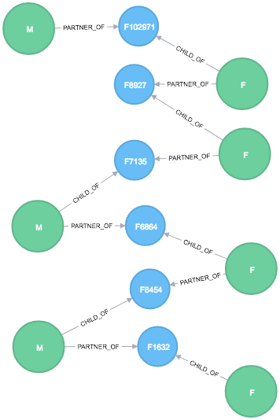

# gedcom-neo4j-converter
Reads a GEDCOM file and imports some of the data into a Neo4j database

Get all A Family of the Root with the partners, their names and children


```
match (n:ROOT)-[:NAME_IS]-(p:Name) 
match (n:ROOT)-[:PARTNER_OF]-(z:Family)-[:CHILD_OF]-(c:Person)-[:NAME_IS]-(t) 
match (n:ROOT)-[:PARTNER_OF]-(z:Family)-[:PARTNER_OF]-(y:Person)-[:NAME_IS]-(r) 
return n, z, c, y, t, r, p
```

Shortest Path Between a person an the ROOT



```
MATCH (n:ROOT)
WITH n
MATCH p = shortestPath((a)-[*1..1000]-(n))
WHERE a.id = 'I23836'
WITH p
RETURN p
```

# GEDCOM to CSV

import csv into database

```
load csv with headers from "file..." as persons create 
(p:Person {id: persons.id, gedcomID: presons.gedcomID, sex: persons.sex})
```

create relationships

```
load csv with headers from "file..." as persons match 
(p:Person {id: persons.id, gedcomID: presons.gedcomID, sex: persons.sex}),
(b: Name {personID: persons.nameID}) create (a)-[r:NAME_IS]->(b)
```

##TO DO
Create Index
Good IDs