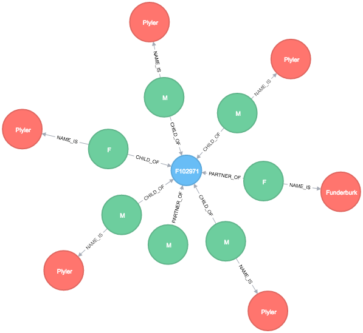

# gedcom-neo4j-converter
Reads a GEDCOM file and imports some of the data into a Neo4j database

Get all A Family of the Root with the partners, their names and children



```
match (n:ROOT)-[:NAME_IS]-(p:Name) 
match (n:ROOT)-[:PARTNER_OF]-(z:Family)-[:CHILD_OF]-(c:Person)-[:NAME_IS]-(t) 
match (n:ROOT)-[:PARTNER_OF]-(z:Family)-[:PARTNER_OF]-(y:Person)-[:NAME_IS]-(r) 
return n, z, c, y, t, r, p
```

Shortest Path Between a person an the ROOT


```
MATCH (n:ROOT)
WITH n
MATCH p = shortestPath((a)-[*1..1000]-(n))
WHERE a.id = 'I23836'
WITH p
RETURN p
```